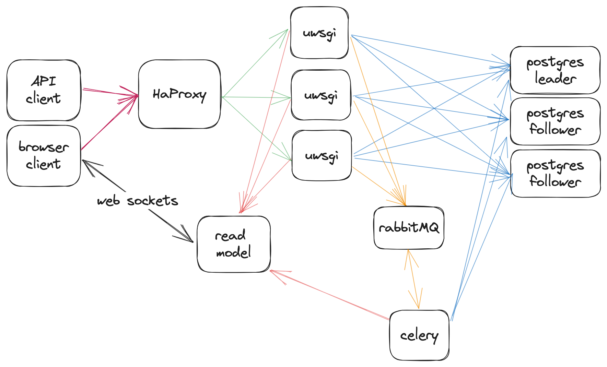

## Technologies used in the project

- JavaScript + React.js - for the frontend application which visualizes the cinema rooms, booking process as well allows the use user book seats themselves
- Node.js + Express + Socket.io - for realtime communication between the frontend and the read model of the application, it allows the frontend to be notified about changes in the read model without the need to poll the backend
- Django - for the backend application which implements the business logic of the application, it also provides the API for the frontend application
- SqlAlchemy - for the ORM layer of the backend application, it allows to query the database in a more convenient way than using raw SQL, it can be configured to use sql queries for the 2 phase commit protocol,
- Postgres - for the database layer of the application, it is used to store the data about bookings, payments and tickets,
- HaProxy - for the reverse proxy layer of the application, it is used to load balance the requests between the backend instances,
- Docker - for containerization of the application, it allows to run the application on any machine which has docker installed,
- Rabbitmq + Celery - for the message broker layer of the application, it is used to notify the saga pattern workflow as well as for notifying the read model about new bookings,
- Python - for the implementation of the backend application, it is used because of the Django framework and SqlAlchemy ORM,
- Typescript - for the implementation of the experiment script, since it is well suited for dealing with concurrency and IO workloads,
- Rust - for the analysis of the experiment results as well as result visualization in the form of graphs and statistics.

## Application logic description

The reservation process consists of the following steps:

- the user selects the movie screening and the seats they want to book,
- the frontend application sends a request to the backend application to book the selected seats,
- the backend application checks whether the seats are available,
- if the seats are available, then the following three things happen atomically on different databases in this order:
  1. the seats are be marked as booked,
  2. the payment is be made,
  3. the ticket is be generated,
- if any of the steps fails then the whole process is rolled back and the seats are marked as available again,
- the frontend application is notified about the result of the booking process.

### Difference between distributed saga pattern and two phase commit protocol

The difference between the distributed saga pattern and the two phase commit protocol is that in the saga pattern the rollback is done by executing compensating actions, while in the two phase commit protocol the rollback is done by executing the rollback phase of the transaction. In the saga pattern the compensating actions are executed in the reverse order of the original actions. In the two phase commit protocol the rollback phase is executed by the coordinator of the transaction, which is the coordinator database instance. In the case of the saga pattern the rollback is done by the backend application so there are intermediate steps where the database state isn't consistent. Consistency is guaranteed on the application level, not on the database level. In the case of the two phase commit protocol the rollback is done by the database so there are no intermediate steps where the database state isn't consistent. Consistency is guaranteed on the database level, not on the application level.

## High-level architecture

### Backend architecture

### Frontend architecture

### Database layer architecture

### Architecture diagram

## Implementation details

## Application description

## Problems and pitfalls

### n+1 query problem and unnecessary queries in Django ORM

### Postgres instances configuration for distributed transactions

### Postgres database connection configuration

### Webserver configuration (connection pool, number of workers, etc.)

### Reverse proxy configuration
